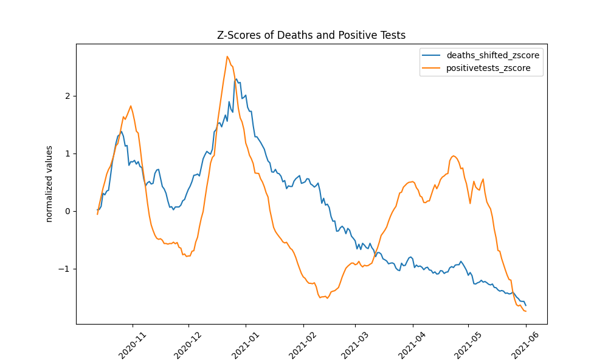

# GOAD🐐 is the GOAT - Goal Oriented Analysis of Data
[](https://github.com/astral-sh/uv)
[](https://pypi.org/project/goad_toolkit/)

<p align="center">
  <em>GOAD🐐 - When your data analysis is so fire🔥 it's got rizz✨</em>
</p>

GOAD🐐 is a flexible Python package for analyzing, transforming, and visualizing data with an emphasis on statistical distribution fitting and modular visualization components.

## 📊 Features

- **Composable & extendable plotting system** - Build complex visualizations by combining simple components. You can extend the existing components with your own.
- **Statistical distribution fitting** - Automatically fit and compare distributions to your data. The distribution registry is extendable with additional distributions.
- **Extendable data transformation pipelines** - Chain and reuse data transformations into pipelines. Again, extendable with custom transformation components.

> Before GOAD🐐 : mid data
> After GOAD🐐 : data got infinity aura

## 🚀 Quick Start

### Installation
Using [uv](https://docs.astral.sh/uv/):
```bash
uv install goad
```

Or, if you prefer your dependencies to be installed 100x slower, with pip:
```bash
pip install goad
```

## 📋 Demo: Linear Model Analysis

GOAD🐐 includes a comprehensive [demo](demo/linear.py) that shows how to use its components together.

### Main capabilities
In the [demo/linear.py](demo/linear.py) file you can see a showcase of the main capabilities of GOAD🐐:
- create a data processing pipeline
- components are extendable, so you can easily add your own steps to a pipeline
- create visualisations by stacking components. `BasePlot` will handle boilerplate.
- the `DistributionFitter` will try to fit a few common distributions, and add statistical tests for you
- The results work together with the `visualizer.PlotFits` class to show the results

The main strenght of this module is not that these elements are there (even thought they are very useful). Its superpower is that everything is extendable: so you can use this as a start, and extend it with your own visualisations and analytics.

> POV: Your data just got GOADed🐐 and now it's giving main character energy

## 📚 Core Components

#### 🔄 Extendable Data Transforms

GOAD🐐 provides a pipeline approach to transform your data:

```python
from goad.datatransforms import Pipeline, ShiftValues, ZScaler

# Create a pipeline
pipeline = Pipeline()

# Add transformations
pipeline.add(ShiftValues, name="shift_deaths", column="deaths", period=-14)
pipeline.add(ZScaler, name="scale_tests", column="positivetests", rename=True)

# Apply all transformations
result = pipeline.apply(data)
```

Available transforms include:
- `ShiftValues` - Shift values in a column by a specified period
- `DiffValues` - Calculate the difference between consecutive values
- `SelectDataRange` - Select rows within a specified date range
- `RollingAvg` - Calculate rolling average of a column
- `ZScaler` - Standardize values in a column

You can extend the pipeline with your own transformations by subclassing `BaseTransform`. The Zscaler is implemented as follows:

```python
class ZScaler(TransformBase):
    """Standardize the values in a column."""
    def transform(
        self, data: pd.DataFrame, column: str, rename: bool = False
    ) -> pd.DataFrame:
        """Standardize the values in a column."""
        if rename:
            colname = f"{column}_zscore"
        else:
            colname = column
        data[colname] = (data[column] - data[column].mean()) / data[column].std()
        return data
```

### 📊 Visualization System

GOAD🐐 visualization system is built on a composable architecture that allows you to build complex plots by combining simpler components:

```python
from goad.visualizer import PlotSettings, ResidualPlot

# Create plot settings
plotsettings = PlotSettings(
        xlabel="date",
        ylabel="normalized values",
        title="Z-Scores of Deaths and Positive Tests",
    )

class LinePlot(BasePlot):
    """Plot a line plot using seaborn."""
    def build(self, data: pd.DataFrame, **kwargs):
        sns.lineplot(data=data, ax=self.ax, **kwargs)
        return self.fig, self.ax


class ComparePlot(BasePlot):
    def build(self, data: pd.DataFrame, x: str, y1: str, y2: str, **kwargs):
        compare = LinePlot(self.settings)
        self.plot_on(compare, data=data, x=x, y=y1, label=y1, **kwargs)
        self.plot_on(compare, data=data, x=x, y=y2, label=y2, **kwargs)
        plt.xticks(rotation=45)

        return self.fig, self.ax

compareplot = ComparePlot(plotsettings)
compareplot.plot(
        data=data, x="date", y1="deaths_shifted_zscore", y2="positivetests_zscore"
    )
```

This extendable strategy lets BasePlot handle the boilerplate, while you can focus on creating the visualizations you need.
It is also easier to reuse components in different contexts.
### 📈 Distribution Fitting

GOAD🐐 includes tools for fitting statistical distributions to your data:

```python
from goad.analytics import DistributionFitter
from goad.visualizer import PlotSettings, FitPlotSettings, PlotFits

fitter = DistributionFitter()
fits = fitter.fit(data["residual"], discrete=False) # we have to decide if the data is discrete or not
best = fitter.best(fits)
settings = PlotSettings(
    figsize=(12, 6), title="Residuals", xlabel="error", ylabel="probability"
)
fitplotsettings = FitPlotSettings(bins=30, max_fits=3)
fitplotter = PlotFits(settings)
fig = fitplotter.plot(
    data=data["residual"], fit_results=fits, fitplotsettings=fitplotsettings
)
```
For the [kstest](https://docs.scipy.org/doc/scipy/reference/generated/scipy.stats.kstest.html), the null hypothesis is that the two distributions are identical. In this example, the p-values are below 0.05, so we can reject the null hypothesis and conclude that the data does not follow any of these.

The plots are sorted by log-likelihood, which means there is no good fit with a distribution in this case.


### 🧩 Extending with Custom Distributions

You can easily register new distributions:

```python
from goad.distributions import DistributionRegistry
from scipy import stats

# Create registry
registry = DistributionRegistry()

# Register a new distribution
registry.register_distribution(
    name="negative_binomial",
    dist=stats.nbinom,
    is_discrete=True,
    num_params=2
)

# Now it will be used automatically in the  DistributionFitter for discrete fits
from goad.analytics import DistributionFitter
fitter = DistributionFitter()
print(fitter.registry) # shows all registered distributions
```


## 🔧 Advanced Usage: Composing Plots

GOAD🐐 has a powerful plotting system that allows you to combine plot elements:

```python
from goad.visualizer import BasePlot, LinePlot, BarWithDates, VerticalDate

# Use a base plot to create a composite
class MyCompositePlot(BasePlot):
    def build(self, data: pd.DataFrame, x: str, y1: str, y2: str, special_date: str):
        # Plot the first component - a line plot
        line_plot = LinePlot(self.settings)
        self.plot_on(line_plot, data=data, x=x, y=y1, label=y1)

        # Plot the second component - a bar chart
        bar_plot = BarWithDates(self.settings)
        self.plot_on(bar_plot, data=data, x=x, y=y2)

        # Add a vertical line
        vline = VerticalDate(self.settings)
        self.plot_on(vline, date=special_date, label="Important Event")
        return self.fig, self.ax
```

## 🤝 Contributing

Contributions are welcome! Please feel free to submit a Pull Request.

---

<p align="center">
  <em>GOAD🐐 - When your data analysis is so fire🔥 it's got rizz✨</em>
</p>
